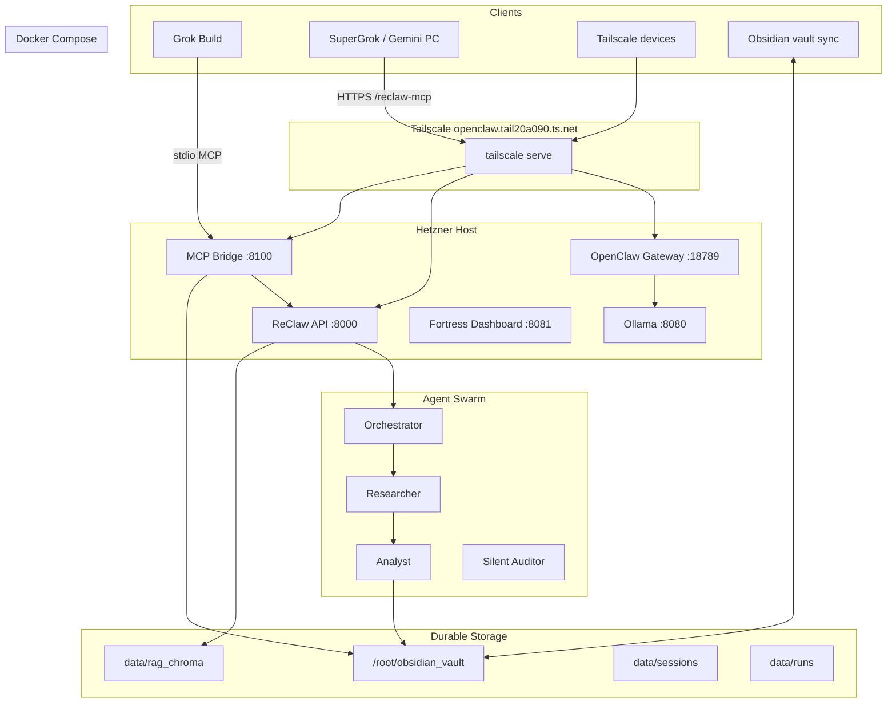

# ReClaw 2.0 Platform Handbook

> **Single reference for everything wired, built, and running on production.**  
> Last updated: **2026-07-05** · Branch: `ravenstack` · Server: Hetzner `178.156.235.36`

---

## Table of Contents

1. [Executive Summary](#1-executive-summary)
2. [Production Environment](#2-production-environment)
3. [Port & Service Map](#3-port--service-map)
4. [Architecture Diagram](#4-architecture-diagram)
5. [Repository Layout](#5-repository-layout)
6. [Gateway API Reference](#6-gateway-api-reference)
7. [Pike/Winslow Pipeline](#7-pikewinslow-pipeline)
8. [Ravenstack & Obsidian Vault](#8-ravenstack--obsidian-vault)
9. [RAG Knowledge System](#9-rag-knowledge-system)
10. [Kimi Build Ideas Integration](#10-kimi-build-ideas-integration)
11. [OpenClaw Gateway](#11-openclaw-gateway)
12. [Grok Build & MCP Connectors](#12-grok-build--mcp-connectors)
13. [LLM Wiring (Ollama, xAI, Gemini)](#13-llm-wiring-ollama-xai-gemini)
14. [Docker & Systemd](#14-docker--systemd)
15. [Environment Variables](#15-environment-variables)
16. [Security & Approval Gates](#16-security--approval-gates)
17. [Operations Cheat Sheet](#17-operations-cheat-sheet)
18. [Git Status & Publishing](#18-git-status--publishing)
19. [Known Gaps & Roadmap](#19-known-gaps--roadmap)
20. [Deployment Changelog](#20-deployment-changelog)
21. [Related Documentation](#21-related-documentation)

---

## 1. Executive Summary

**ReClaw 2.0** is a general-purpose agent operating platform (OpenClaw-pattern aligned) with a production rural-data workflow module. It runs on a Hetzner box and is accessed primarily over **Tailscale** — no public ports required.

| What | Where |
|------|-------|
| **GitHub repo** | https://github.com/jasandroidx/ReClaw-2.0 |
| **Active branch** | `ravenstack` |
| **Server path** | `/root/ReClaw-2.0` (not `/opt/reclaw`) |
| **Public IP** | `178.156.235.36` (SSH/SCP only; services are tailnet) |
| **Tailscale hostname** | `openclaw.tail20a090.ts.net` |
| **Obsidian vault** | `/root/obsidian_vault` |
| **Ravenstack SOT** | `/root/obsidian_vault/Ravenstack/` |

**Revenue priority:** Pike/Winslow faceless YouTube ContentPackages daily → grants/leads → side tasks.

**Core principles** (from `SOUL.md`):
- Truth + provenance only. No hype.
- Least privilege + explicit approval gates for risky actions.
- Session isolation for every run (full audit trail on disk).
- Obsidian is the durable output + human review surface.
- Docker + Tailscale on Hetzner = prod. Local PC = dev mirror.

---

## 2. Production Environment

### Host

| Property | Value |
|----------|-------|
| OS | Linux 6.8.x (Ubuntu on Hetzner) |
| Repo | `/root/ReClaw-2.0` |
| Python venv | `/root/ReClaw-2.0/.venv` |
| OpenClaw config | `/root/.openclaw/openclaw.json` |
| Grok Build config | `/root/.grok/config.toml` + `/root/ReClaw-2.0/.grok/config.toml` |
| Env files | `/root/ReClaw-2.0/.env`, `/root/.env` (never commit) |

### Live stack snapshot (2026-07-05)

| Container / Service | Status | Notes |
|---------------------|--------|-------|
| `reclaw-api` | healthy | FastAPI gateway on `:8000` |
| `reclaw-dashboard` | healthy | Static Phaser fortress on host `:8081` |
| `openclaw-gateway` | healthy | Host network on `:18789` |
| Ollama | running | Local `:8080`, model `llama3.1:8b` pulled |
| `reclaw-mcp-bridge` (systemd) | **inactive** | HTTP MCP on `:8100` — needs enable/start |
| RAG index | synced | 24 documents, **281 chunks** in Chroma |

### File upload to server

```bash
scp -r ./my-folder root@178.156.235.36:/root/ReClaw-2.0/
```

Or over Tailscale SSH once joined to the tailnet.

---

## 3. Port & Service Map

| Port | Service | Bind | Access |
|------|---------|------|--------|
| **8000** | ReClaw API (`reclaw-api`) | `0.0.0.0` via Docker | `http://127.0.0.1:8000` |
| **18789** | OpenClaw gateway | host network | `http://127.0.0.1:18789` |
| **8081** | Fortress dashboard (Phaser) | Docker map `8081→8080` | `http://127.0.0.1:8081` |
| **8080** | Ollama (local LLM) | host | `http://127.0.0.1:8080` |
| **8100** | MCP HTTP bridge | `127.0.0.1` (when running) | Tailscale `/reclaw-mcp` |

### Tailscale serve paths

```
https://openclaw.tail20a090.ts.net/
|-- /           → http://127.0.0.1:18789   (OpenClaw gateway)
|-- /reclaw     → http://127.0.0.1:8000    (ReClaw API)
|-- /reclaw-mcp → http://127.0.0.1:8100    (MCP HTTP bridge)
```

**Remote health checks (from any tailnet device):**

```bash
curl -sf https://openclaw.tail20a090.ts.net/reclaw/health
curl -sf https://openclaw.tail20a090.ts.net/health
```

---

## 4. Architecture Diagram



---

## 5. Repository Layout

```
/root/ReClaw-2.0/
├── api/                    # FastAPI gateway (main.py)
├── agents/                 # Agent implementations + SOUL.md identities
│   ├── orchestrator.py     # Sequences Researcher → Analyst
│   ├── researcher.py
│   ├── analyst.py
│   ├── silent_auditor.py   # Kimi integration (compliance)
│   └── <name>/SOUL.md      # Per-agent identity files
├── core/                   # Platform kernel
│   ├── config.py           # Env-driven settings (RECLAW_* prefix)
│   ├── security.py       # Capability registry + approval gates
│   ├── handoff.py          # ResearchPackage, AnalysisPackage, ContentPackage
│   ├── session.py          # Isolated session dirs
│   ├── knowledge.py        # KnowledgeManager (Oracle/Ravenstack)
│   └── obsidian_writer.py  # Vault writes
├── rag/                    # Phase C: RAG pipeline (Kimi integration)
│   ├── api.py              # /rag/* router
│   ├── client.py           # RAGClient SDK
│   ├── vectorstore.py      # ChromaDB
│   ├── vault_sync.py       # Obsidian auto-sync
│   └── extractors/         # PDF, DOCX, CSV, web, image OCR
├── scripts/                # Ops + MCP servers
│   ├── reclaw_platform_mcp_server.py   # Unified connector (17 tools)
│   ├── ravenstack_mcp_server.py
│   ├── reclaw_api_mcp_server.py
│   ├── post-deploy-healthcheck.sh
│   ├── run-reclaw-mcp-bridge.sh
│   ├── ingest.py
│   └── verify.sh
├── skills/                 # OpenClaw/ClawHub skill packages
├── .grok/                    # Grok Build project config
│   ├── config.toml
│   ├── skills/reclaw-build/SKILL.md
│   └── plugins/reclaw-ops/
├── dashboard/              # Fortress UI (gitignored on disk; local changes)
│   ├── index.html          # Phaser RPG (served on :8081)
│   ├── rag-dashboard/      # React RAG UI (not on compose port yet)
│   └── ravenstack-fortress/ # Next.js fortress (merged, not primary serve)
├── docker-compose.yml
├── docker/Dockerfile
├── knowledge/              # Git-tracked Ravenstack knowledge (dev mirror)
├── data/
│   ├── seeds/              # Pike/Winslow deterministic test data
│   ├── sessions/           # Per-run audit trail
│   ├── runs/               # Completed package JSON artifacts
│   └── rag_chroma/         # Chroma persistence (runtime)
├── docs/                   # Documentation
├── outputs/obsidian/       # Dev fallback vault path
└── ingestion/              # Research datasets (anomalies, budgets, salaries)
```

### Key identity / rule files (read every task)

| File | Purpose |
|------|---------|
| `SOUL.md` | Platform soul — truth, gates, isolation |
| `RAVENSTACK-ORACLE.md` | Single source of truth bible (also in vault) |
| `RAVENSTACK-ARCHITECTURE.md` | System architecture rules |
| `agents/*/SOUL.md` | Per-agent identity |
| `AGENTS.md` | Routing and capabilities |

---

## 6. Gateway API Reference

Base URL (local): `http://127.0.0.1:8000`  
Base URL (tailnet): `https://openclaw.tail20a090.ts.net/reclaw`

### Core endpoints

| Method | Path | Description |
|--------|------|-------------|
| `GET` | `/health` | Platform health + RAG availability |
| `POST` | `/trigger/{county}` | Async pipeline job (Bearer auth) |
| `POST` | `/run-sync` | Blocking Pike/Winslow run |
| `GET` | `/jobs/{job_id}` | Job status |
| `GET` | `/jobs/latest` | Most recent run metadata |
| `GET` | `/packages` | List recent ContentPackages |
| `GET` | `/capabilities` | Declared capability registry |
| `POST` | `/sessions/{id}/approve` | Grant pending capability |
| `GET` | `/sessions/{id}/approvals` | Pending + granted approvals |
| `GET` | `/sessions` | Recent session list |
| `GET` | `/sessions/{id}` | Session handoffs + task |
| `POST` | `/re-export/{package_id}` | Re-render package to Obsidian |
| `POST` | `/ingest` | Upload file → Kimi distill → vault |

### RAG endpoints (`/rag/*`)

| Method | Path | Description |
|--------|------|-------------|
| `POST` | `/rag/search` | Semantic search with citations |
| `POST` | `/rag/ingest` | Ingest file path or URL |
| `POST` | `/rag/ingest/web` | Ingest web page |
| `POST` | `/rag/vault/sync` | Full vault re-index |
| `GET` | `/rag/vault/status` | Sync status |
| `GET` | `/rag/documents` | List ingested docs |
| `GET` | `/rag/documents/{id}` | Document chunks |
| `DELETE` | `/rag/documents/{id}` | Remove document |
| `GET` | `/rag/info` | RAG system status |

### Example calls

```bash
# Health
curl -sf http://127.0.0.1:8000/health | python3 -m json.tool

# Sync Pike/Winslow (blocking)
curl -sf -X POST 'http://127.0.0.1:8000/run-sync?county=Pike&area=Winslow&write_obsidian=true'

# RAG search
curl -sf -X POST http://127.0.0.1:8000/rag/search \
  -H 'Content-Type: application/json' \
  -d '{"query": "Pike County red flags", "top_k": 5}'

# Vault sync
curl -sf -X POST http://127.0.0.1:8000/rag/vault/sync
```

### Auth

`POST /trigger/{county}` requires `Authorization: Bearer <RECLAW_GATEWAY_TOKEN>`.  
Set `RECLAW_GATEWAY_TOKEN` and `OPENCLAW_GATEWAY_TOKEN` to the **same value** in `.env`. See [Environment Variables](#15-environment-variables).

---

## 7. Pike/Winslow Pipeline

The **rural_data** module is the first concrete domain on the general platform.

### Flow

```
Gateway → create_session() → SecurityManager grants
    → Orchestrator.run_county()
        → Researcher (seeds or live_fetch)
        → Analyst (heuristic red flags + insights)
        → Quality gates (risk_score ≤ 8 or override)
        → ContentPackage → ObsidianWriter
```

### Handoff contracts (`core/handoff.py`)

| Type | Role |
|------|------|
| `ResearchPackage` | County data: properties, budgets, salaries |
| `AnalysisPackage` | Red flags, insights, channel angles, risk score |
| `ContentPackage` | Final deliverable for Obsidian + YT scripts |
| `CompliancePackage` | Silent Auditor output (Kimi) |
| `AgentEvent` | Visual office contract (future frontend) |

### Session artifacts

Every run creates `data/sessions/<session_id>/`:

```
sessions/<id>/
├── task.json
├── soul/           # Copied SOUL.md files
├── handoffs/       # researcher.json, analyst.json
├── approvals/      # pending/ + granted/
└── logs/           # session.log, security.log
```

Completed packages also land in `data/runs/<timestamp>_<package_id>.json`.

### Obsidian output

Written to vault subdir `Rural Data/` (configurable via `RECLAW_OBSIDIAN_SUBDIR`):

```
/root/obsidian_vault/Rural Data/
├── 2026-07-05-pike-winslow.md
├── 2026-07-05-pike-winslow.json
└── _latest.md
```

### Seeds vs live fetch

| Mode | Env | Behavior |
|------|-----|----------|
| Seeds (default) | `USE_LIVE_FETCH=false` | Deterministic `data/seeds/` JSON |
| Live | `USE_LIVE_FETCH=true` + approval | HTTP to county .gov / GIS |

---

## 8. Ravenstack & Obsidian Vault

### Vault layout

```
/root/obsidian_vault/
├── Ravenstack/              # SOT knowledge base
│   ├── RAVENSTACK-ORACLE.md
│   ├── RAVENSTACK-ARCHITECTURE.md
│   ├── knowledge_index.md
│   ├── principles.md
│   ├── agent-architecture.md
│   ├── income-streams.md
│   └── backlog/             # Distilled ingest notes
├── Rural Data/              # Pipeline output (faceless YT)
├── Rooms/                   # Visual fortress room data
└── Forges/                  # ClawForge artifacts
```

### KnowledgeManager (`core/knowledge.py`)

- Loads Oracle rules on every gateway start
- `ingest_document()` / `save_to_backlog()` — ORACLE-compliant distillation
- `get_section()` — targeted Oracle section reads
- Production path: `RECLAW_KNOWLEDGE_PATH=/root/obsidian_vault/Ravenstack`

### Ingestion pipeline (`scripts/ingest.py`)

Distills PDFs/books per Oracle rules → canonical MD in Ravenstack backlog → triggers RAG reload.

### Reload ritual

After bulk ingest:

```bash
cd /root/ReClaw-2.0
PYTHONPATH=. python3 -m core.cell "Reload ritual"
# or via MCP: ravenstack__reload_ritual
```

---

## 9. RAG Knowledge System

Full docs: [docs/rag/README.md](rag/README.md)

### Current production stats

| Metric | Value |
|--------|-------|
| Embedding model | `all-MiniLM-L6-v2` (local, 384-dim) |
| Vector store | ChromaDB `data/rag_chroma` |
| Collection | `reclaw_knowledge` |
| Documents synced | 24 |
| Total chunks | 281 |
| Chunk size / overlap | 500 / 100 |

### Supported formats

PDF, DOCX, CSV, TXT, MD, images (OCR), web pages.

### Config (env prefix `RAG_` or defaults in `rag/config.py`)

See `.env.example` for `RAG_MODEL`, `RAG_CHUNK_SIZE`, `RAG_PERSIST_DIR`, `RAG_VAULT_SYNC_INTERVAL`.

### Agent integration

```python
from rag.client import RAGClient
client = RAGClient()
results = client.search("grant opportunities rural Indiana", top_k=5, vault_only=True)
```

Every result includes full citation metadata (source path, section, page).

---

## 10. Kimi Build Ideas Integration

**Source reference:** `/root/Kimi_Agent_ReClaw-2.0 Build Ideas/` (uploaded; not in git)  
**Integration commit:** `de15408` — Integrate Kimi build ideas: RAG pipeline, Silent Auditor, skills

### What was integrated

| Component | Location | Status |
|-----------|----------|--------|
| Full RAG module | `rag/` | ✅ Live on API |
| RAG API router | `rag/api.py` → `api/main.py` | ✅ Mounted at `/rag/*` |
| Silent Auditor agent | `agents/silent_auditor.py` | ✅ Code present; needs DOGEGPT data + pandas at runtime |
| CompliancePackage | `core/handoff.py` | ✅ Model defined |
| Skills copied | `skills/` + OpenClaw workspace | ✅ Registered in security.py |
| RAG React dashboard | `dashboard/rag-dashboard/` | ⚠️ Not served on compose port |
| Next.js fortress | `dashboard/ravenstack-fortress/` | ⚠️ Merged; `:8081` still serves Phaser `index.html` |

### Fixes applied during integration

- Chroma metadata sanitization (`rag/vectorstore.py` — `_sanitize_chroma_value`)
- Removed `BackgroundTasks` from `rag/api.py` sync endpoints
- Lazy pandas import in `agents/silent_auditor.py` (prevents API crash on import)
- Removed eager silent_auditor from `agents/__init__.py`

---

## 11. OpenClaw Gateway

**Image:** `ghcr.io/openclaw/openclaw:latest`  
**Mode:** host network, port `18789`  
**Config:** `/root/.openclaw/openclaw.json`

### Model stack (agents.defaults)

| Role | Model |
|------|-------|
| Primary | `ollama-cloud/gemma3:12b` |
| Fallback 1 | `ollama/llama3.1:8b` (local `:8080`) |
| Fallback 2 | `google/gemini-2.5-flash` |

### Enabled skills (12 active)

`gemini`, `obsidian`, `obsidian-cli-official`, `oracle`, `summarize`, `skillscan`, `skill-vetter`, `self-critique`, `loop-anything-skill`, `approval_gate`, `clawsmith`, `outreach_crafter`, `seo_auditor`

### Auth

Gateway token mode — value set in `openclaw.json` and mirrored in `.env` as `OPENCLAW_GATEWAY_TOKEN`. **Never commit the actual token.**

### Auth profiles

- `ollama-cloud:manual` — Ollama Cloud API
- `google:manual` — Gemini API

---

## 12. Grok Build & MCP Connectors

Grok Build is the preferred operator for Hetzner server work (vs Cursor for local dev).

### Config locations

| File | Scope |
|------|-------|
| `/root/.grok/config.toml` | Global Grok Build |
| `/root/ReClaw-2.0/.grok/config.toml` | Project-scoped |
| `.grok/skills/reclaw-build/SKILL.md` | ReClaw specialist skill |

### MCP servers configured

| Server | Transport | Tools prefix | Purpose |
|--------|-----------|--------------|---------|
| **reclaw-platform** | stdio (primary) | `reclaw-platform__*` | Unified connector — **use this first** |
| reclaw-platform-remote | HTTP (disabled) | same | Remote via Tailscale |
| ravenstack | stdio | `ravenstack__*` | Oracle + knowledge ops |
| reclaw-api | stdio | `reclaw-api__*` | API-only tools |
| reclaw-fs | stdio | filesystem | Repo + vault file access |
| obsidian | stdio | obsidian | Vault MCP |
| github | stdio (disabled) | github | Needs `gh auth login` |
| brave-search | disabled | — | Needs API key |
| playwright | disabled | — | Browser automation |

### reclaw-platform tools (17)

| Tool | Description |
|------|-------------|
| `query_knowledge` | RAG semantic search with citations |
| `read_oracle` | Read RAVENSTACK-ORACLE.md (optional section) |
| `list_knowledge_topics` | List Ravenstack markdown files |
| `ingest_to_ravenstack` | Distill content into backlog |
| `save_ravenstack_note` | Write distilled note with frontmatter |
| `read_vault_file` | Read Obsidian vault file |
| `write_vault_file` | Write Obsidian vault file |
| `read_repo_file` | Read ReClaw repo file |
| `reclaw_health` | API health JSON |
| `run_pike_winslow` | Run rural_data pipeline |
| `rag_sync_vault` | Re-index vault into RAG |
| `list_pipeline_sessions` | Recent session folders |
| `stack_health` | Full post-deploy healthcheck |
| `docker_status` | `docker compose ps` |
| `openclaw_health` | OpenClaw gateway health |
| `git_status` | Git branch/status |
| `connector_help` | Setup instructions |

### Verify MCP

```bash
cd /root/ReClaw-2.0
grok mcp doctor reclaw-platform   # expect 17 tools
```

### Remote MCP (Grok/Gemini from your PC)

1. Start HTTP bridge on server:

```bash
# One-shot
./scripts/run-reclaw-mcp-bridge.sh

# Or enable systemd (create unit if missing):
sudo systemctl enable --now reclaw-mcp-bridge
```

2. Ensure Tailscale serve path `/reclaw-mcp` → `:8100` is active.

3. In Grok config on your PC:

```toml
[mcp_servers.reclaw-platform]
url = "https://openclaw.tail20a090.ts.net/reclaw-mcp/mcp"
```

**Note:** SuperGrok web UI cannot add custom MCPs. Use **Grok Build** (CLI/IDE) or Tailscale HTTP bridge.

### Cursor vs Grok Build

| Task | Tool |
|------|------|
| Hetzner deploy, docker, MCP, vault ops | **Grok Build** on server |
| Local code editing, PRs | Cursor on dev PC |
| GitHub MCP | Either — needs `gh auth login` |

---

## 13. LLM Wiring (Ollama, xAI, Gemini)

### Local Ollama

- Host: `http://127.0.0.1:8080`
- Model pulled: `llama3.1:8b` (4.9 GB)
- OpenClaw provider config points local Ollama at `/v1` OpenAI-compatible API

### Cloud providers (keys in `.env` only)

| Key | Used by |
|-----|---------|
| `XAI_API_KEY` | Grok/xAI models via Grok Build |
| `GEMINI_API_KEY` / `GOOGLE_API_KEY` | Gemini fallback in OpenClaw |
| `OLLAMA_API_KEY` | Ollama Cloud (`ollama-cloud/gemma3:12b`) |

`docker-compose.yml` passes `XAI_API_KEY`, `GEMINI_API_KEY`, `GOOGLE_API_KEY`, `OLLAMA_API_KEY` to `openclaw-gateway`.

**Never put API keys in this handbook or in git.** Copy from `.env.example` and fill in locally.

---

## 14. Docker & Systemd

### docker-compose.yml services

```yaml
reclaw-api:
  - Port 8000, user 1000:1000
  - Volumes: repo, data, outputs, /root/obsidian_vault → /vault
  - RECLAW_ENV=prod, knowledge at /vault/Ravenstack

reclaw-dashboard:
  - python3 -m http.server on dashboard/ → host :8081

openclaw-gateway:
  - network_mode: host
  - Port 18789, config at /root/.openclaw
```

### Deploy cycle

```bash
cd /root/ReClaw-2.0
docker compose config
docker compose down --remove-orphans
docker compose up -d --build
./scripts/post-deploy-healthcheck.sh
```

### Ownership fix (after volume changes)

```bash
sudo chown -R 1000:1000 \
  /root/obsidian_vault \
  /root/.openclaw \
  /root/ReClaw-2.0/data \
  /root/ReClaw-2.0/outputs
```

### MCP HTTP bridge

Script: `scripts/run-reclaw-mcp-bridge.sh`  
- `MCP_TRANSPORT=streamable-http`
- `FASTMCP_HOST=127.0.0.1`, `FASTMCP_PORT=8100`
- Sources `/root/.env` for tokens (use `KEY=value` format, not `export`)

**Current status:** systemd unit not active. Tailscale path exists but bridge must be started.

### Recommended systemd unit

```ini
# /etc/systemd/system/reclaw-mcp-bridge.service
[Unit]
Description=ReClaw MCP HTTP Bridge
After=network.target docker.service

[Service]
Type=simple
User=root
WorkingDirectory=/root/ReClaw-2.0
ExecStart=/root/ReClaw-2.0/scripts/run-reclaw-mcp-bridge.sh
Restart=on-failure
RestartSec=5

[Install]
WantedBy=multi-user.target
```

```bash
sudo systemctl daemon-reload
sudo systemctl enable --now reclaw-mcp-bridge
```

---

## 15. Environment Variables

Copy `.env.example` → `.env`. All `RECLAW_*` settings use the `RECLAW_` prefix (see `core/config.py`).

### Required for production

| Variable | Description |
|----------|-------------|
| `RECLAW_ENV` | `prod` on server |
| `RECLAW_OBSIDIAN_VAULT_PATH` | `/root/obsidian_vault` (or `/vault` in container) |
| `RECLAW_GATEWAY_TOKEN` | Bearer token for `/trigger` |
| `OPENCLAW_GATEWAY_TOKEN` | Same value as above |
| `OBSIDIAN_SUBDIR` | `Rural Data` |

### Optional LLM keys

| Variable | Description |
|----------|-------------|
| `XAI_API_KEY` | xAI / Grok |
| `GEMINI_API_KEY` | Google Gemini |
| `GOOGLE_API_KEY` | Alias for Gemini |
| `OLLAMA_API_KEY` | Ollama Cloud |

### RAG tuning

| Variable | Default |
|----------|---------|
| `RAG_MODEL` | `all-MiniLM-L6-v2` |
| `RAG_CHUNK_SIZE` | `500` |
| `RAG_CHUNK_OVERLAP` | `100` |
| `RAG_PERSIST_DIR` | `data/rag_chroma` |

### Important fix (gateway token)

`core/config.py` field is `gateway_token` (maps to `RECLAW_GATEWAY_TOKEN`). The old `reclaw_gateway_token` name did **not** read the env var correctly — fixed in recent commits.

### `/root/.env` format

Use `KEY=value` lines only. **`export KEY=value` breaks systemd** unit EnvironmentFile parsing.

---

## 16. Security & Approval Gates

See [docs/SECURITY.md](SECURITY.md) for full detail.

### Capability registry (`core/security.py`)

| Capability | Risk | Approval |
|------------|------|----------|
| `public_data_seed` | low | auto |
| `public_data_live_fetch` | medium | required |
| `heuristic_analysis` | low | auto |
| `obsidian_write` | medium | auto (path-controlled) |
| `shell_exec` | high | required |
| `skill_scan` | low | auto |
| `skill_vet` | low | auto |
| `skill_install` | medium | required |
| `grant_scan` | medium | required |
| `compliance_audit` | high | required |
| `job_match` | medium | — |
| `arbitrage_scan` | high | required |
| `script_generate` | low | — |

### Session audit trail

All grants write JSON to `data/sessions/<id>/approvals/granted/`.  
Pending requests go to `approvals/pending/`.

### Marketplace skill policy

Before installing ClawHub skills:
1. `skill_scan` (SkillScan / tokauthai)
2. `skill_vet` (manual SKILL.md review)
3. Register capability in `core/security.py`
4. `skill_install` with approval

### Secrets policy

- **Never** commit `.env`, API keys, or gateway tokens
- This handbook references `.env.example` only
- Rotate tokens if exposed

---

## 17. Operations Cheat Sheet

### Daily health

```bash
cd /root/ReClaw-2.0
./scripts/post-deploy-healthcheck.sh
```

### Run Pike/Winslow

```bash
curl -sf -X POST 'http://127.0.0.1:8000/run-sync?county=Pike&area=Winslow&write_obsidian=true'
```

### RAG vault sync

```bash
curl -sf -X POST http://127.0.0.1:8000/rag/vault/sync
curl -sf http://127.0.0.1:8000/rag/info | python3 -m json.tool
```

### Docker logs

```bash
docker compose logs --tail=100 reclaw-api
docker compose logs --tail=50 openclaw-gateway
```

### Tailscale serve reset

```bash
tailscale serve reset
tailscale serve --bg --set-path=/ http://127.0.0.1:18789
tailscale serve --bg --set-path=/reclaw http://127.0.0.1:8000
tailscale serve --bg --set-path=/reclaw-mcp http://127.0.0.1:8100
tailscale serve status
```

### Full verify script

```bash
./scripts/verify.sh
```

### SCP upload

```bash
scp -r ./local-files root@178.156.235.36:/root/ReClaw-2.0/
```

---

## 18. Git Status & Publishing

### Remote

```
https://github.com/jasandroidx/ReClaw-2.0
Branch: ravenstack
```

### Unpushed commits (8 ahead of origin as of 2026-07-05)

```
849d0de feat(mcp): unified reclaw-platform connector (SuperGrok-style)
595ad5f chore(env): wire XAI and Gemini API keys through compose and examples
04c4b46 feat(ops): Ravenstack MCP connector + Grok Build upgrade + Ollama wiring
de15408 Integrate Kimi build ideas: RAG pipeline, Silent Auditor, skills
962444f fix(ops): restore working dashboard map, healthchecks, and status polling
1fc708c feat(security): register skill_scan, skill_vet, skill_install capabilities
d433c78 feat(grok-build): add project-scoped ReClaw specialist skill and MCP stack
40a9615 fix(deploy): restore full ReClaw stack with dual Tailscale serve paths
```

### Push from server

```bash
gh auth login          # one-time
cd /root/ReClaw-2.0
git push origin ravenstack
```

### Push from dev PC

```bash
git remote add hetzner root@178.156.235.36:/root/ReClaw-2.0
# or pull commits via scp/rsync then push to GitHub from PC
```

**Current blocker:** `gh auth login` not completed on server.

---

## 19. Known Gaps & Roadmap

| Gap | Impact | Fix |
|-----|--------|-----|
| Git push blocked | Handbook + 8 commits not on GitHub | `gh auth login` on server or push from PC |
| GitHub MCP disabled | No PR/issue ops from Grok | `gh auth login` + enable in config.toml |
| MCP HTTP bridge inactive | Remote `/reclaw-mcp` returns connection refused | `systemctl enable --now reclaw-mcp-bridge` |
| RAG React dashboard not on port | No hosted RAG UI on compose | Add nginx/service for `dashboard/rag-dashboard/` |
| Silent Auditor runtime | Agent needs DOGEGPT data + pandas | Install deps + seed compliance data |
| `dashboard/` gitignored | Fortress fixes only on disk | Decide: track or deploy script |
| `commands.ownerAllowFrom` unset | OpenClaw command restrictions open | Set in openclaw.json when ready |
| SuperGrok web custom MCP | Cannot add reclaw-platform in browser | Use Grok Build or Tailscale HTTP |
| README merge conflict | Stale `<<<<<<< HEAD` markers | Fixed in this commit |
| Stale `/opt/reclaw` paths in docs | Confusion | Use `/root/ReClaw-2.0` everywhere |

### Next phases

- Real live county fetchers (beyond seeds)
- Scriptwriter agent for faceless YT episodes
- Grant Hall / Job Aggregator cells in fortress
- Full e2e swarm with visual office event bus
- Income loops: ClawHub cells, monetizable output quality gates

---

## 20. Deployment Changelog

| Date | Commit | Summary |
|------|--------|---------|
| 2026-07-05 | `849d0de` | Unified `reclaw-platform` MCP connector (17 tools) |
| 2026-07-05 | `595ad5f` | XAI/Gemini env through docker-compose |
| 2026-07-05 | `04c4b46` | Ravenstack MCP + Grok Build upgrade + Ollama wiring |
| 2026-07-05 | `de15408` | Kimi RAG integration + Silent Auditor |
| 2026-07-05 | `962444f` | Dashboard map + healthchecks restored |
| 2026-07-05 | `1fc708c` | skill_scan/vet/install capabilities |
| 2026-07-05 | `d433c78` | reclaw-build Grok skill + MCP stack |
| 2026-07-05 | `40a9615` | Full stack restore + dual Tailscale serve |
| Earlier | `9713e9b` | Ravenstack fortress + Oracle chamber + ingest |
| Earlier | — | Gateway token field fix (`gateway_token`) |
| Earlier | — | Chroma metadata sanitization for vault sync |
| Earlier | — | MCP bridge port fix (`FASTMCP_PORT=8100`) |
| Earlier | — | `/root/.env` export-line systemd fix |

---

## 21. Related Documentation

| Doc | Path |
|-----|------|
| **This handbook** | `docs/PLATFORM-HANDBOOK.md` |
| Setup | `docs/SETUP.md` |
| Tailscale | `docs/tailscale.md` |
| Security | `docs/SECURITY.md` |
| Architecture | `docs/ARCHITECTURE.md` |
| Handoff contracts | `docs/HANDOFF.md` |
| RAG module | `docs/rag/README.md` |
| Knowledge vault ingest | `KNOWLEDGE_VAULT.md` |
| Oracle SOT | `RAVENSTACK-ORACLE.md` / vault copy |
| Grok Build skill | `.grok/skills/reclaw-build/SKILL.md` |
| Agent routing | `AGENTS.md` |

---

*Generated for the ReClaw 2.0 production deployment. For updates, edit this file and commit to `ravenstack`.*