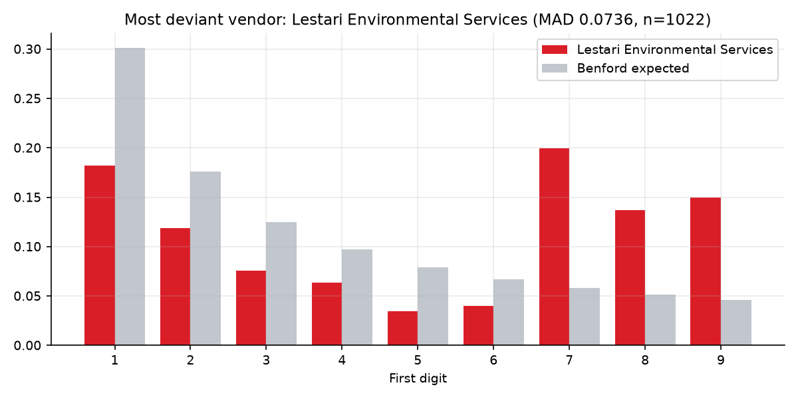
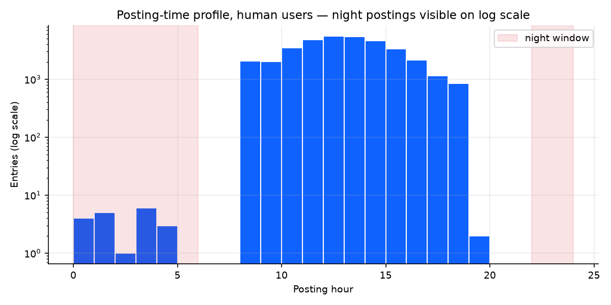

# 🔍 Audit Analytics Toolkit — Journal-Entry Testing (CAATs)


**Computer-assisted audit techniques (CAATs)** applied to a full-year general
ledger: the journal-entry tests an IT-audit / technology-assurance team runs
when addressing fraud risk (ISA 240), implemented in Python and **proven
against known ground truth**.

A seeded generator produces ~36,000 realistic FY2025 AP journal lines
(60 vendors, 25 users with defined posting/approval rights) and **plants 509
control exceptions across six classes**. The toolkit must then find them —
and a pytest suite verifies each detector's recall against the plants.

## The six audit tests

| Test | What it catches | Result on this ledger |
|---|---|---|
| **Benford's law** (population + per-vendor MAD) | Fabricated invoice amounts | Planted vendor isolated at MAD 0.074 = nonconformity; clean population conforms at 0.002 |
| **Duplicate payments** | Same vendor + amount within 7 days | 29 entries, RM 168k exposure |
| **Threshold splitting** | Invoice clusters just under the RM 50k approval limit | 23 entries, RM 1.08m exposure |
| **Off-hours postings** | Night/weekend entries by human users (batch jobs excluded) | 30 entries — zero false positives |
| **Segregation of duties** | Self-approval, or approver without approval rights | 10 entries — exact match to plants |
| **Round amounts** | Vendors with abnormal rates of round-thousand invoices | 25 entries on one vendor |

Full auto-generated working paper: [`reports/findings.md`](reports/findings.md) ·
flagged entries: [`reports/flagged_entries.csv`](reports/flagged_entries.csv)

| | |
|---|---|
|  |  |

## Why MAD and not chi-square?

With ~36k entries, the chi-square statistic rejects even trivial deviations
from Benford (it scales with *n*). The toolkit reports both but decides on
**Nigrini's mean absolute deviation**, which is sample-size independent —
the population scores *close conformity* (MAD 0.002) while the per-vendor
drill-down cleanly isolates the fabricating vendor (MAD 0.074), whose first
digits pile up in 7–9: amounts kept just under a review limit.

## Detectors are tested, not trusted

`tests/test_detectors.py` evaluates every detector against the planted
ground truth (`data/ground_truth.csv`):

- recall ≥ 90–100% per exception class, measured — not assumed
- off-hours detector: **zero false positives** and never flags the batch user
- SoD detector: **exact match** with the planted set
- a control test confirms the *clean* population conforms to Benford, so
  detectors react to the plants, not to generator artefacts

Two detector bugs were found and fixed this way during development — e.g. the
splitting detector originally anchored only on a group's first invoice, so an
unrelated near-threshold invoice earlier in the year masked a genuine cluster.

## Run it

```bash
pip install -r requirements.txt

python src/generate_ledger.py       # seeded synthetic ledger + ground truth
pytest                              # prove detectors against the plants
python src/run_audit.py             # findings.md + flagged_entries.csv + charts
```

Fully reproducible — no downloads, no credentials, one seed.

## Structure

```
├── src/
│   ├── generate_ledger.py   # synthetic FY2025 AP ledger + planted exceptions
│   ├── audit_tests.py       # the six detectors (pure pandas functions)
│   └── run_audit.py         # runs everything -> reports/
├── tests/
│   └── test_detectors.py    # recall/precision vs ground truth
└── reports/                 # committed sample output (findings, flags, charts)
```

> Synthetic data only — vendor and user names are fictional. Built as a
> portfolio demonstration of IT-audit data analytics.
