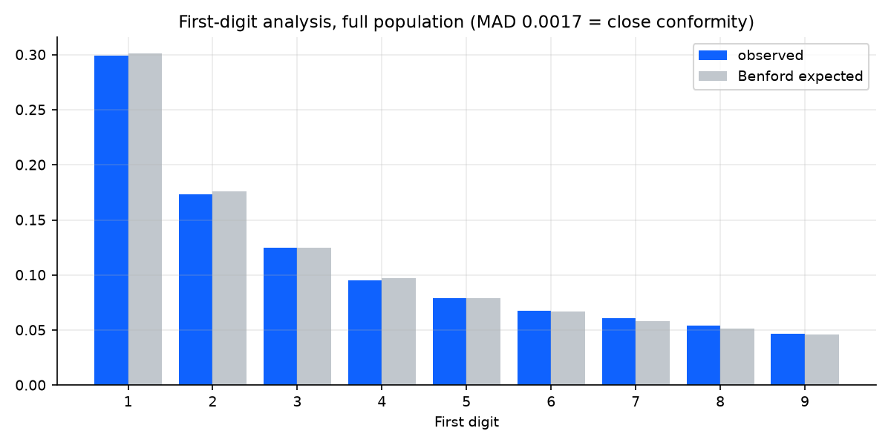

# Journal-entry testing — findings summary

_Auto-generated by `src/run_audit.py` on 2026-07-05. Population: **35,909 journal lines**, FY2025, 60 vendors, 25 users._

## Exceptions by test

| Audit test | Entries flagged | Value flagged (RM) |
|---|---:|---:|
| Duplicate payments | 29 | 167,870 |
| Threshold splitting | 23 | 1,079,919 |
| Off-hours postings | 30 | 180,332 |
| SoD violations | 10 | 107,509 |
| Round amounts | 25 | 400,000 |

## Benford's-law analysis

- Population of 35,909 amounts: MAD **0.0017** (close conformity); chi-square 15 (with n this large, chi-square rejects trivial deviations — MAD is the decision metric).
- Per-vendor drill-down (vendors with ≥100 entries): most deviant is **Lestari Environmental Services** with MAD **0.0736** (nonconformity) across 1022 entries — first digits cluster in 7–9, the classic signature of fabricated amounts kept below a review limit.

| Most deviant vendors | MAD | Verdict |
|---|---:|---|
| Lestari Environmental Services (1022 entries) | 0.0736 | nonconformity |
| KL Metro Services Sdn Bhd (593 entries) | 0.0191 | nonconformity |
| Mutiara Cleaning Services (561 entries) | 0.0141 | marginal conformity |
| Rawang Cement Distributors (547 entries) | 0.0130 | marginal conformity |
| Bukit Bintang Media Group (600 entries) | 0.0120 | acceptable conformity |

## Charts

## Basis of testing

Procedures mirror standard journal-entry testing for fraud risk (ISA 240):
digit-frequency analysis, duplicate-payment search, approval-threshold
splitting, off-hours posting review, segregation-of-duties testing, and
round-amount analysis. Detection logic: [`src/audit_tests.py`](../src/audit_tests.py).